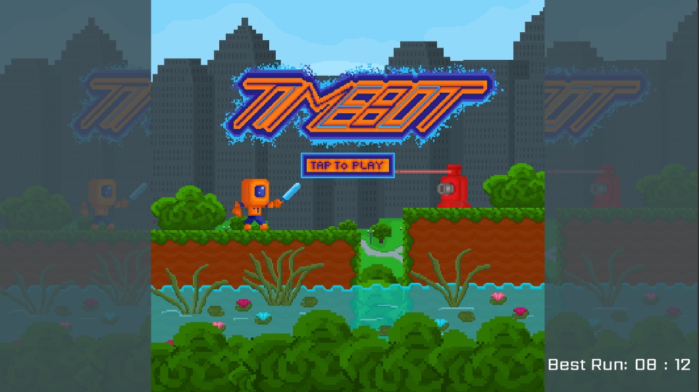
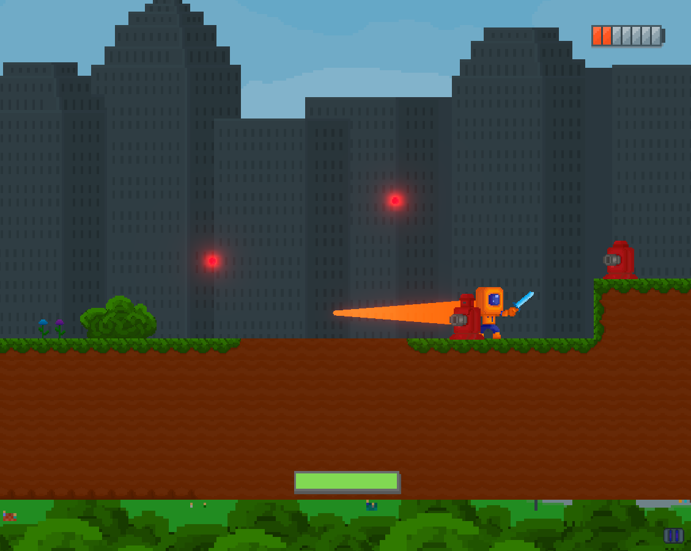
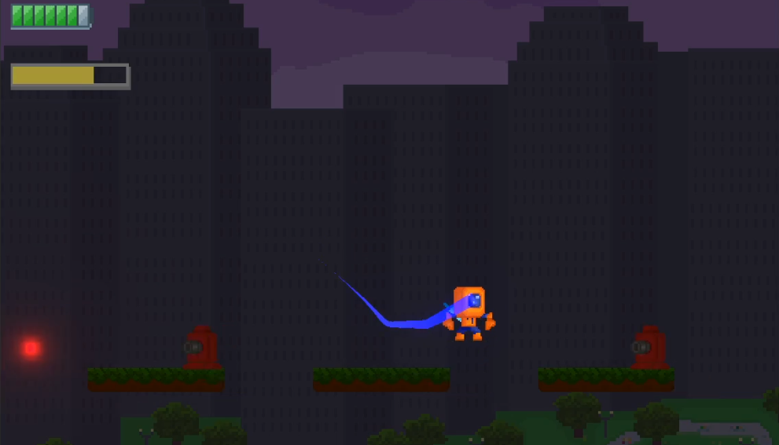
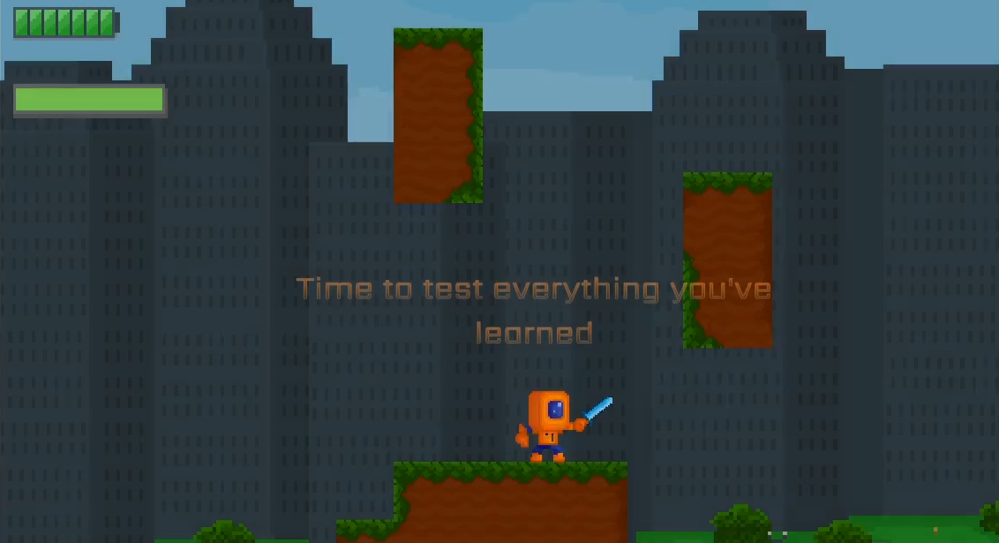
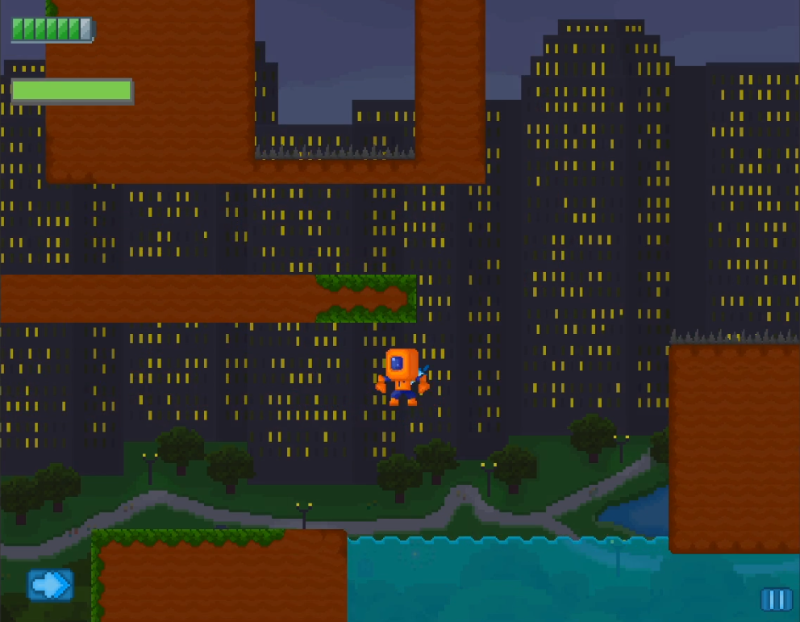

# Timebot
Game made for the [Gamedev.tv](https://itch.io/jam/gamedevtv-community-jam) game jam.  
You can play the game [here](https://nachodlv.github.io/timebot).  

## Introduction
Welcome to our testing facility.  
It seems it's your first time being commissioned,  are you up to the task?  
We have unplugged you from the main grid and it's your turn to show us your skills and reach the main battery at the end of each course to keep yourself alive!  
Nevertheless since time is of the essence and you are one of are latests models we have equipped you with a very useful tool. This tool, a time manipulator, is still a prototype so be wary of its duration.  
Good luck out there.!!  

## Instructions
- Move using the arrow keys or w a s d
- Press w or up key to jump (You can jump twice!)
- Press E or K to stop time
- Press Shift or L to dash
- Press Q or J to draw your sword, and Q or J again to attack

## Colaborators
- [Juan Bautista Arambarri](https://github.com/JuanArambarri) - SFX and composer
- Lara Mariel Ozbic - SFX, producer and composer
- Rocío Paulucci - Artist

## Screenshots

